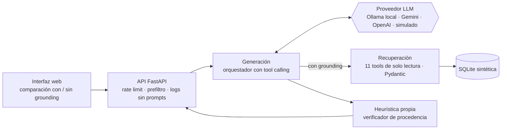

# Copiloto de Operaciones Cloud con cifras verificadas

[](https://github.com/hankotsu/copiloto-opscloud-llm/actions/workflows/ci.yml)

Asistente de IA que responde en lenguaje natural sobre el **inventario, los respaldos, la red y los costos** de una nube OCI, **sin inventar cifras**. El LLM decide qué consultar y redacta la respuesta, pero no calcula: las cifras salen de tools de solo lectura (**grounding por tool calling**), y un **verificador de procedencia** propio comprueba que cada número, fecha y recurso de la respuesta provenga de esas tools.

> Proyecto final del curso **Fundamentos de Arquitectura LLM** (programa *Certified AI/LLM Solution Architect*, BSG Institute), evaluado sobre la **Opción 02: Asistente con Grounding y Control de Alucinación** (personalizada).
> Propuesta: [`docs/propuesta_proyecto.pdf`](docs/propuesta_proyecto.pdf) · Mapeo a la rúbrica: [`docs/PLAN_OPCION_02.md`](docs/PLAN_OPCION_02.md) · Límites: [`docs/LIMITES.md`](docs/LIMITES.md)

## Estado (entrega: 04/10/2026)

- [x] **H1 · Datos:** dataset sintético, golden set de 32 preguntas, casos de inyección y CI
- [x] **H2 · Backend:** tools de recuperación, orquestador de generación, modo **con y sin grounding**, límites configurados
- [x] **H3 · Heurística:** verificador de procedencia (capas 1, 1b, 2 y 3) + casos adversariales A1–A8
- [x] **H4 · Evaluación:** runner con exactitud por modo, matriz de la heurística y 32 pares documentados
- [x] **H5 · Interfaz:** comparación lado a lado, marca del verificador y fuentes
- [ ] **H6 · Resultados con modelos reales**, `docs/LIMITES.md` completo y video

## Arquitectura



| Módulo | Rol en la opción 02 |
|---|---|
| `backend/tools.py` | **Recuperación:** 11 tools tipadas, solo lectura, devuelven solo las filas relevantes (máx. 25) y agregados calculados por SQL |
| `backend/orquestador.py` | **Generación:** ciclo ReAct con límites (iteraciones, reintentos, `max_tokens`, `temperature`); mismo prompt base con y sin grounding |
| `backend/verificador.py` | **Heurística anti-alucinación:** procedencia de cifras, fechas y recursos; coherencia cifra–recurso; afirmación sin evidencia; derivados verificables |
| `backend/seguridad.py` | Prefiltro determinista (credenciales, inyección directa), token canario, huella para logs |
| `backend/proveedores.py` | Adaptadores: Ollama nativo (`num_ctx`), OpenAI-compatible (OpenAI y Gemini), simulado |
| `eval/run_eval.py` | Evaluación: golden set con y sin grounding, N corridas, matriz de la heurística, `PARES.md` |

## Inicio rápido

Requisitos: Python 3.12, Git y, para usar un LLM real, Ollama con un modelo con soporte de *tools* o una API key de Gemini.

```bash
git clone https://github.com/hankotsu/copiloto-opscloud-llm.git
cd copiloto-opscloud-llm
python -m venv .venv
source .venv/bin/activate                      # Windows: .venv\Scripts\activate
pip install -r requirements-dev.txt
cp .env.example .env                           # Windows: copy .env.example .env

python data_gen/generar_dataset_sintetico.py   # crea data/ en ~2 s
pytest -q                                      # 36 tests: dataset, tools, verificador, orquestador y API

ollama pull qwen2.5:7b                         # o el modelo que elija (ver docs/GUIA_IMPLEMENTACION.md)
uvicorn backend.main:app --reload --host 127.0.0.1 --port 8000
# Interfaz: http://127.0.0.1:8000 · API: http://127.0.0.1:8000/docs
```

Sin Ollama ni API keys, elija el proveedor **simulado** en la interfaz: funciona de punta a punta con reglas deterministas.

### Evaluación

```bash
python eval/run_eval.py --proveedor ollama --corridas 3
python eval/run_eval.py --proveedor gemini --corridas 3 --pausa 7
```

Los resultados (`RESUMEN.md`, `PARES.md`, `respuestas.jsonl`) quedan en `eval/resultados/<fecha>_<proveedor>_<modelo>/` y se versionan como evidencia.

## Datos

Todos los datos son **sintéticos**: un tenancy ficticio (*Andes Demo Energía S.A.C.*) con 120 instancias, 240 discos, 15 bases de datos y 3 meses de costos diarios, con hallazgos sembrados. No se versionan: se regeneran de forma determinista con `data_gen/`. Detalle en [`data_gen/README.md`](data_gen/README.md).

## Seguridad (OWASP Top 10 for LLM Applications 2025)

| Riesgo | Control |
|---|---|
| LLM01 Prompt Injection | Prefiltro de inyección directa; el texto libre de tags y descripciones llega marcado `_no_confiable`; 3 casos de inyección indirecta en la evaluación |
| LLM02 Sensitive Information Disclosure | API keys solo en `.env`; logs con la huella de la pregunta, nunca su contenido; gitleaks en pre-commit y CI |
| LLM05 Improper Output Handling | La interfaz inserta la respuesta como texto (`textContent`), nunca como HTML |
| LLM06 Excessive Agency | Tools de solo lectura sobre SQLite abierta en modo `ro`; el servicio no tiene credenciales de ninguna nube |
| LLM07 System Prompt Leakage | Token canario en el prompt de sistema; si aparece en la salida, la respuesta se bloquea |
| LLM10 Unbounded Consumption | Rate limit por cliente, `max_tokens`, máximo de iteraciones y de reintentos, largo máximo de la pregunta |

Checklist ético (Sesión 5): [`docs/ETICA.md`](docs/ETICA.md).

## Estructura

```
backend/      API FastAPI: recuperación (tools), generación (orquestador) y heurística (verificador)
frontend/     interfaz web de una sola página, servida por la API
eval/         runner de evaluación, puntaje y resultados versionados
data_gen/     generador del dataset sintético y su documentación
tests/        36 tests: dataset, tools, verificador (casos A1–A8), orquestador, adaptadores y API
scripts/      guardia de confidencialidad (pre-commit y CI)
docs/         propuesta, plan (opción 02), guía de implementación, guía de GitHub, límites y ética
```

## Video

Enlace al video explicativo (≤ 30 min): *pendiente*.

## Autor

Hans Berrocal Carranza · Licencia MIT
