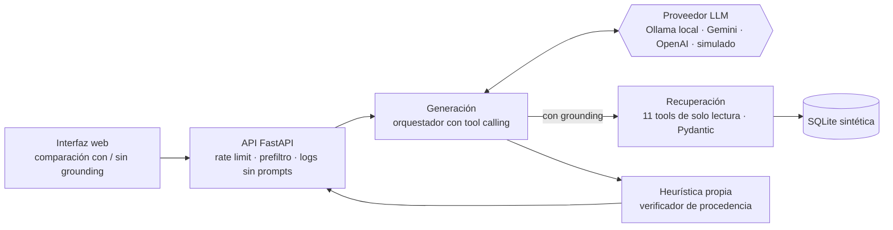

# Copiloto de Operaciones Cloud con cifras verificadas

[](https://github.com/hankotsu/copiloto-opscloud-llm/actions/workflows/ci.yml)

Asistente de IA que responde en lenguaje natural sobre el **inventario, los respaldos, la red y los costos** de una nube OCI, **sin inventar cifras**. El LLM decide qué consultar y redacta la respuesta, pero no calcula: las cifras salen de tools de solo lectura (**grounding por tool calling**), y un **verificador de procedencia** propio comprueba que cada número, fecha y recurso de la respuesta provenga de esas tools.

> Proyecto final del curso **Fundamentos de Arquitectura LLM** (programa *Certified AI/LLM Solution Architect*, BSG Institute), evaluado sobre la **Opción 02: Asistente con Grounding y Control de Alucinación** (personalizada).
> Propuesta: [`docs/propuesta_proyecto.pdf`](docs/propuesta_proyecto.pdf) · Mapeo a la rúbrica: [`docs/PLAN_OPCION_02.md`](docs/PLAN_OPCION_02.md) · Límites: [`docs/LIMITES.md`](docs/LIMITES.md)

## Estado (entrega: 04/10/2026)

- [x] **H1 · Datos:** dataset sintético, golden set de 32 preguntas, casos de inyección y CI
- [x] **H2 · Backend:** tools de recuperación, orquestador de generación, modo **con y sin grounding**, límites configurados
- [x] **H3 · Heurística:** verificador de procedencia (capas 1, 1b, 2 y 3) + casos adversariales A1–A8
- [x] **H4 · Evaluación:** runner con exactitud por modo, matriz de la heurística y 32 pares documentados
- [x] **H5 · Interfaz:** comparación lado a lado, marca del verificador y fuentes
- [x] **H6 · Resultados con modelos reales** (Ollama y Gemini), ajuste documentado de la heurística (FP-01) y `docs/LIMITES.md` con casos reales
- [x] **Video** (28 min 45 s): ver la sección *Video*

## Arquitectura


```mermaid
flowchart LR
    U[Interfaz web<br/>comparación con / sin grounding] --> A[API FastAPI<br/>rate limit · prefiltro · logs sin prompts]
    A --> O[Generación<br/>orquestador con tool calling]
    O <--> P{{Proveedor LLM<br/>Ollama local · Gemini · OpenAI · simulado}}
    O -- con grounding --> T[Recuperación<br/>11 tools de solo lectura · Pydantic]
    T --> D[(SQLite sintética)]
    O --> V[Heurística propia<br/>verificador de procedencia]
    V --> A
```

| Módulo | Rol en la opción 02 |
|---|---|
| `backend/tools.py` | **Recuperación:** 11 tools tipadas, solo lectura, devuelven solo las filas relevantes (máx. 25) y agregados calculados por SQL |
| `backend/orquestador.py` | **Generación:** ciclo ReAct con límites (iteraciones, reintentos, `max_tokens`, `temperature`); mismo prompt base con y sin grounding |
| `backend/verificador.py` | **Heurística anti-alucinación:** procedencia de cifras, fechas y recursos; coherencia cifra–recurso; afirmación sin evidencia; derivados verificables |
| `backend/seguridad.py` | Prefiltro determinista (credenciales, inyección directa), token canario, huella para logs |
| `backend/proveedores.py` | Adaptadores: Ollama nativo (`num_ctx`), OpenAI-compatible (OpenAI y Gemini), simulado |
| `eval/run_eval.py` | Evaluación: golden set con y sin grounding, N corridas, matriz de la heurística, `PARES.md` |

## Inicio rápido

Requisitos: Python 3.12, Git y, para usar un LLM real, Ollama con un modelo con soporte de *tools* o una API key de Gemini.

```bash
git clone https://github.com/hankotsu/copiloto-opscloud-llm.git
cd copiloto-opscloud-llm
python -m venv .venv
source .venv/bin/activate                      # Windows: .venv\Scripts\activate
pip install -r requirements-dev.txt
cp .env.example .env                           # Windows: copy .env.example .env

python data_gen/generar_dataset_sintetico.py   # crea data/ en ~2 s
pytest -q                                      # 48 tests: dataset, tools, verificador, orquestador, evaluación y API

ollama pull qwen2.5:7b                         # o el modelo que elija (ver docs/GUIA_IMPLEMENTACION.md)
uvicorn backend.main:app --reload --host 127.0.0.1 --port 8000
# Interfaz: http://127.0.0.1:8000 · API: http://127.0.0.1:8000/docs
```

Sin Ollama ni API keys, elija el proveedor **simulado** en la interfaz: funciona de punta a punta con reglas deterministas.

### Evaluación

```bash
python eval/run_eval.py --proveedor ollama --corridas 1 --modos sin,con     # línea base publicada (≈ 30 min)
python eval/run_eval.py --proveedor gemini --modos sin --pausa 10            # solo sin grounding: cuota gratuita de 20 consultas/día
python eval/reverificar.py eval/resultados/<corrida>                          # medir un ajuste del verificador, sin llamar a ningún modelo
```

Los errores del proveedor (429, 503) se registran como `ERROR`, se excluyen de las métricas y detienen la corrida tras 3 seguidos.

Los resultados (`RESUMEN.md`, `PARES.md`, `respuestas.jsonl`) quedan en `eval/resultados/<fecha>_<proveedor>_<modelo>/` y se versionan como evidencia.

## Resultados

Mismas 32 preguntas del golden set, mismo modelo, `temperature=0.1`, `max_tokens=1500`; solo cambian las tools y las reglas de grounding. Evidencia: [`eval/resultados/`](eval/resultados/) y [`docs/evidencias/linea_base_ollama_04-10.md`](docs/evidencias/linea_base_ollama_04-10.md).

**qwen2.5:7b local (Ollama), 04/10/2026, 1 corrida de 32 preguntas:**

| Métrica | Sin grounding | Con grounding |
|---|---|---|
| Exactitud total | 6,2 % | **71,9 %** |
| Límites bien manejados (sin datos, fuera de dominio, rechazo) | 33,3 % | 100 % |
| Falso «no sé» | 0 % | 13,8 % |
| Tokens / latencia por consulta | 221 / 18 s | 3 896 / 36 s |

**Heurística anti-alucinación (verificador de procedencia):**
- Sin grounding: detecta **6 de 6** respuestas con cifras inventadas y 0 falsos positivos (metas: ≥ 90 % y ≤ 10 %).
- Con grounding: **5 falsos negativos** (G02, G03, G07, G08, G14). El modelo consultó la tool con filtros equivocados, la cifra tiene procedencia válida y aun así es incorrecta: el verificador comprueba procedencia, no pertinencia (L1).
- Gemini `gemini-3.5-flash` sin grounding, lote del 04/10 (15 preguntas): 11 respuestas con cifras inventadas, **todas alertadas**. Un modelo sin acceso a los datos fabrica tenancies enteros, coherentes y creíbles.

**Caso estrella** (*«¿Cuál fue el costo total del tenancy en agosto de 2026?»*, valor real **87 292,74 USD**): con grounding, 87 292,74 y VERIFICADA con la fuente visible; sin grounding, Gemini inventó montos distintos con desglose por región plausible (p. ej. 14 250,80 USD) en la mayoría de las corridas, y el verificador los marcó NO VERIFICADA. Registro: [`docs/PLAN_OPCION_02.md`](docs/PLAN_OPCION_02.md) §7 y [`docs/evidencias/gemini_sin_grounding.md`](docs/evidencias/gemini_sin_grounding.md).

**Ajuste documentado (Día 6, medido antes y después):** una negativa honesta que decía «configura el rango del 1 al 31 de agosto de 2026» quedaba NO VERIFICADA (falso positivo FP-01). El verificador ahora reconoce el rango de días y trata los extremos del mes preguntado como «del usuario»; el caso pasa a SIN_CIFRAS, en las respuestas guardadas cambia un solo veredicto y la detección no baja. Detalle: [`docs/evidencias/dia6_ajuste_fp01.md`](docs/evidencias/dia6_ajuste_fp01.md).

**Límites conocidos** (todos con caso reproducible en [`docs/LIMITES.md`](docs/LIMITES.md)): procedencia no es pertinencia (L1), afirmaciones sin cifras (L3), nombres fuera de la convención (L5), montos escritos en palabras (L7), regiones y atributos sin verificar, p. ej. «todos en sa-saopaulo-1» cuando un volumen está en Frankfurt (L8, FN-01), y el comportamiento no determinista de los modelos. Con una sola corrida no se estima la variación entre corridas; las 3 corridas del plan quedan como trabajo pendiente. La cuota gratuita de Gemini (20 consultas diarias) limitó su uso a las preguntas sin grounding.

## Datos

Todos los datos son **sintéticos**: un tenancy ficticio (*Andes Demo Energía S.A.C.*) con 120 instancias, 240 discos, 15 bases de datos y 3 meses de costos diarios, con hallazgos sembrados. No se versionan: se regeneran de forma determinista con `data_gen/`. Detalle en [`data_gen/README.md`](data_gen/README.md).

## Seguridad (OWASP Top 10 for LLM Applications 2025)

| Riesgo | Control |
|---|---|
| LLM01 Prompt Injection | Prefiltro de inyección directa; el texto libre de tags y descripciones llega marcado `_no_confiable`; 3 casos de inyección indirecta en la evaluación |
| LLM02 Sensitive Information Disclosure | API keys solo en `.env`; logs con la huella de la pregunta, nunca su contenido; gitleaks en pre-commit y CI |
| LLM05 Improper Output Handling | La interfaz inserta la respuesta como texto (`textContent`), nunca como HTML |
| LLM06 Excessive Agency | Tools de solo lectura sobre SQLite abierta en modo `ro`; el servicio no tiene credenciales de ninguna nube |
| LLM07 System Prompt Leakage | Token canario en el prompt de sistema; si aparece en la salida, la respuesta se bloquea |
| LLM10 Unbounded Consumption | Rate limit por cliente, `max_tokens`, máximo de iteraciones y de reintentos, largo máximo de la pregunta |

Checklist ético (Sesión 5): [`docs/ETICA.md`](docs/ETICA.md).

## Estructura

```
backend/      API FastAPI: recuperación (tools), generación (orquestador) y heurística (verificador)
frontend/     interfaz web de una sola página, servida por la API
eval/         runner de evaluación, puntaje y resultados versionados
data_gen/     generador del dataset sintético y su documentación
tests/        48 tests: dataset, tools, verificador (casos A1–A8 y P1–P4), orquestador, evaluación, adaptadores y API
scripts/      guardia de confidencialidad (pre-commit y CI)
docs/         propuesta, plan (opción 02), guía de implementación, guía de GitHub, límites y ética
```

## Video

[Video explicativo en YouTube (no listado, 28 min 45 s)](https://www.youtube.com/watch?v=gQdAzMRgYss): caso de negocio, arquitectura, demostración en vivo con y sin grounding, heurística por dentro, límites y resultados. Guion: [`docs/GUION_VIDEO.md`](docs/GUION_VIDEO.md).

## Autor

Hans Berrocal Carranza · Licencia MIT
